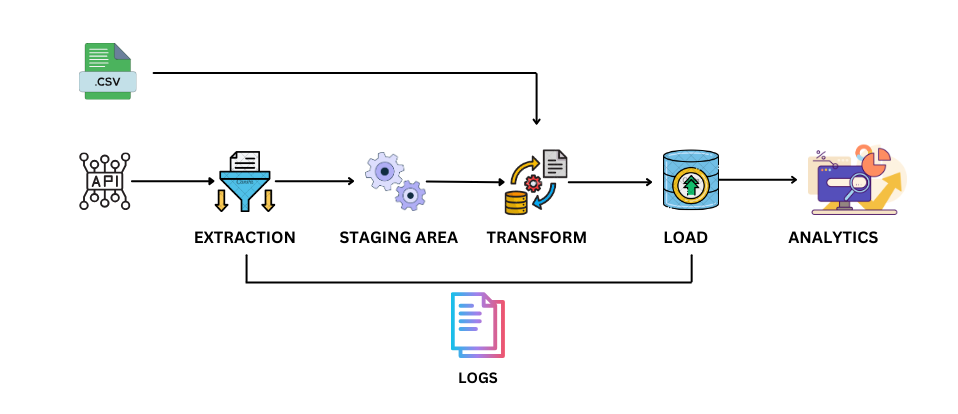

# ETL-WITH-PYTHON (Extract, Transform, Load)

🌟 Automating Web Data Extraction with an ETL Pipeline! 🌐🐍
 I recently built an ETL pipeline for web scraping using Python.
 
 📋 Here’s the workflow:
1️⃣ Extract: Web data fetched seamlessly using Python’s Requests and BeautifulSoup.
2️⃣ Transform: Structured and cleaned using Pandas for ready-to-use insights.
3️⃣ Load: Stored efficiently in both CSV files and SQLite databases.

💡 Key Tools in Action:

Requests & BeautifulSoup: Robust web scraping.
Pandas: Data cleaning and transformation wizardry.
SQLite: Lightweight and structured data storage.
Icecream: Debugging simplified like never before!
🔧 Why it matters:
This project highlights how Python’s libraries make data extraction and transformation powerful, scalable, and efficient. It’s an exciting step forward in applying automation to real-world data workflows!

